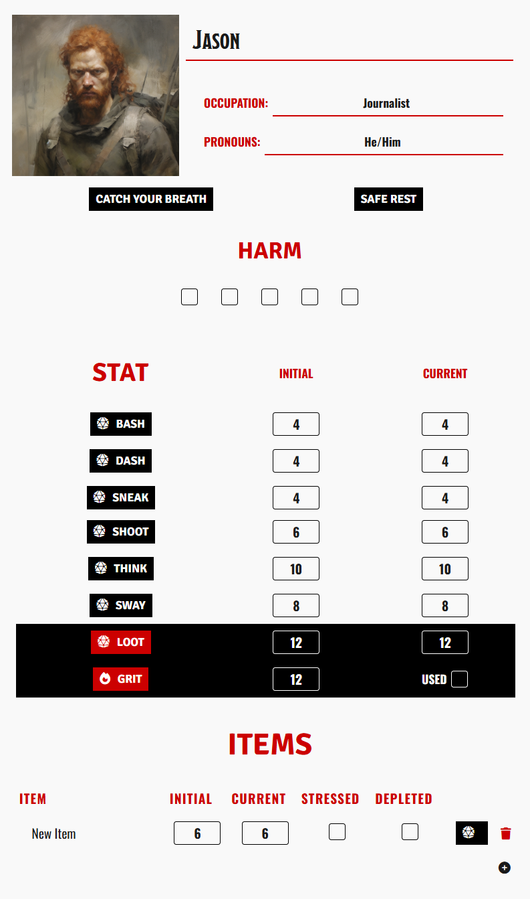

# breathless_2e_unofficial
An unofficial automated **BREATHLESS: FRIGHTMARE EDITION** character sheet for Foundry VTT.

Learn more about Breathless at: https://farirpgs.com/breathless/

This system for Foundry VTT was built using the Custom System Builder.

### Setup and Configuration

1. Create a new world and select **Custom System Builder** as the system.
2. Log in as the Gamemaster and create a new template.
3. Right-click the new template and select **Import Data**. Upload the `breathless_2e.json` file.
4. In Manage Modules, enable the **Custom CSS** module (ensure you have it installed in Foundry).
5. Go to **Game Settings > Custom CSS > Custom CSS Rules** and paste the contents of `breathless_2e.css`.

The character sheet will appear with this visual style for the players.

### 1. Automatic Dice Degradation
The Step-Down mechanic is the core of the Breathless experience. Every time you take a risk, your resources dwindle.
* **The Logic:** When you click a skill button (e.g., BASH, DASH, THINK), the system rolls the current die and automatically downgrades that skill's value for the next use (d12 -> d10 -> d8 -> d6 -> d4).
* **The Floor:** Per the rules, the automation hard-caps at d4.

### 2. Dynamic Positioning Dialogs
Fiction drives the mechanics in this system. Before every skill check, a Positioning dialog appears to reflect the current narrative stakes:
* **Good (+2):** Increases the die by one step before rolling.
* **Standard:** Rolls the current skill die as-is.
* **Bad (-2):** Decreases the die by one step before rolling.

### 3. Gear and Durability Logic
I have integrated the degradation rules directly into the itemized list:
* **1-2:** The item steps down. If it was already Stressed or at a d4, the system automatically marks it as Depleted.
* **3-4:** The system automatically flags the item as Stressed. If it was already Stressed, the system automatically marks it as Depleted.
* **5+:** The item resists the wear of use and remains unchanged.

### 4. Recovery
* **Full Reset:** Both the "Catch Your Breath" and "Safe Rest" buttons instantly restore all current skills to their initial values and reset Grit usage.
* **Narrative Alerts:** The system sends contextual warnings to the chat: "Catch Your Breath" reminds the GM to introduce a consequence, while "Safe Rest" prompts the GM to determine if any Harm was cleared.

### 5. Threat Monitoring
The character sheet constantly monitors your physical integrity. As soon as the fifth Harm box is checked, the UI triggers a "VULNERABLE" alert.

### 6. Loot Logic
When performing a Loot Check, the system processes the roll against the loot table:
* **Results:** The chat output specifies exactly what was found (Nothing, Low-Quality Item, or Standard Item) based on the roll result.
* **Post-Loot Degradation:** Just like skills, your Loot die automatically steps down one level after the check is processed.

## Legal & Credits

This work is based on Breathless, product of Fari RPGs (https://farirpgs.com/), developed and authored by René-Pier Deshaies-Gélinas, and licensed for our use under the Creative Commons Attribution 4.0 License 
(https://creativecommons.org/licenses/by/4.0/). This is an unofficial automation and is not affiliated with Fari RPGs.
